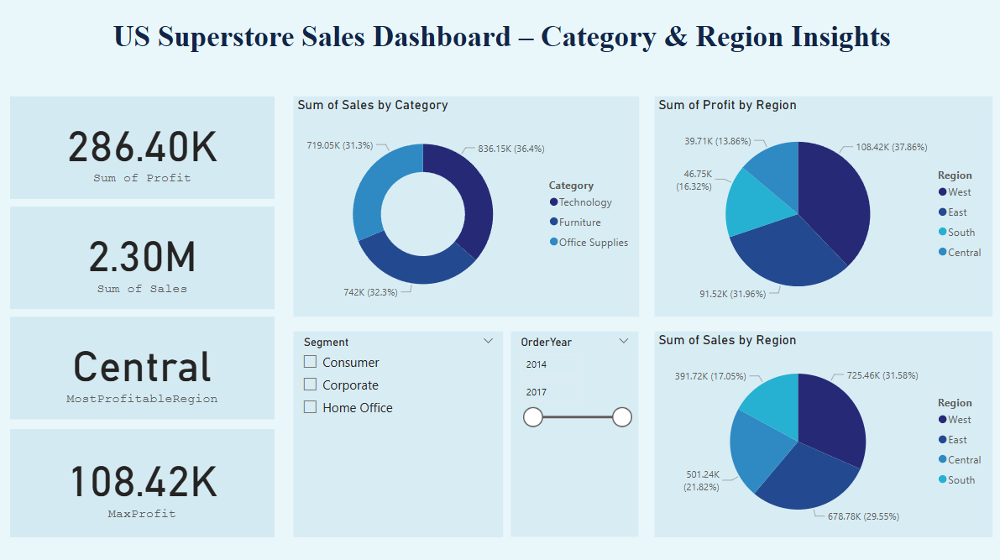

# US Superstore Sales Dashboard – Category & Region Insights

An interactive **Power BI** dashboard created to analyze the **US Superstore** dataset and provide actionable insights on sales and profitability by category, region, and customer segment.  

---

## 📊 Project Overview
The purpose of this dashboard is to provide a visual representation of sales performance and profitability trends across different product categories and geographic regions, helping stakeholders make data-driven decisions.

---

## 🛠 Tools & Technologies Used
- **Power BI** – for dashboard creation and visualization
- **Excel** – for data cleaning and preprocessing
- **SQL** (if applicable) – for data querying and transformation

---

## 📂 Files in this Repository
- `US_Superstore_Sales_Dashboard_Harshita_Bakshi.pbix` – Power BI dashboard file
- `Superstore cleaned dataset.xlsx` – Cleaned dataset used in dashboard
- `Sample - Superstore.xlsx` – Original raw dataset
- `US_Superstore_Sales_Dashboard_Harshita_Bakshi.png` – Dashboard screenshot for quick preview

---

## 🔍 Key Insights
- **Total Sales Revenue:** $706.15K  
- **Total Profit:** $88.52K  
- **Top Sales Category:** Technology – the leading sales driver (36.4% of total sales)  
- **Top Performing Region:** Central Region – contributes 37.86% of total profit  
- **Highest Regional Profit:** $33.48K from the Central Region  
  

---

## 📌 Features
- Clear, concise KPIs showing total sales revenue, profit, top category, and top region
- Sales and profit breakdown by product category
- Regional performance analysis for profit and sales
- Interactive slicers for Customer Segment and Year filtering
- Clean visual design with consistent color palette for quick interpretation

---

## 📊 Dataset Information
The dataset contains sales transactions of the US Superstore, including:
- Order details
- Product categories
- Customer segments
- Regional data
- Sales & profit values

**Source:** [Sample Superstore Dataset](https://www.kaggle.com/datasets/vishakhachhatani/us-superstore-dataset/) 

---

## 📥 How to Use
1. Download the `.pbix` file from this repository.
2. Open it in **Power BI Desktop**.
3. Use slicers to explore data by segment and year.

---

## 👩‍💻 Author
**Harshita Bakshi**  
Data Analyst | Python • SQL • Power BI • Tableau • Excel  
[LinkedIn](www.linkedin.com/in/harshita-bakshi) | [GitHub](https://github.com/harshitabakshiiii)

---

⭐ *If you found this project useful, feel free to star this repository!*
